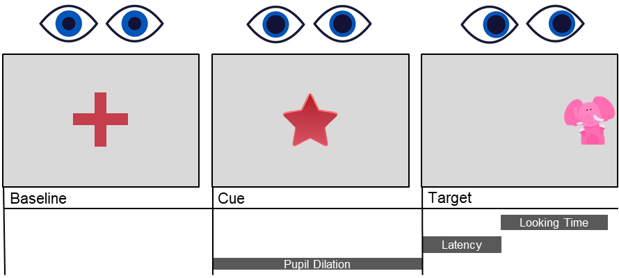

Introduction to eye-tracking
############################

Eye-tracking is a great tool to study cognition. It is especially
suitable for developmental studies, as infants and young children might
have advanced cognitive abilities, but little chances to show them (they
cannot talk!).

This tutorial will teach you all you need to navigate the huge and often
confusing eye-tracking world. First, we will introduce how an experiment
can (and should) be built, explaining how to easily record eye-tracking
data from Python. Then, it will focus on how to analyse the data,
reducing the seemingly overwhelming amount of rows and columns in a few
variables of interest (such as saccadic latency, looking time or pupil
dilation).

How to build an eye-tracking experiment
=======================================

What do you want to measure?
----------------------------

It is much easier to start an eye-tracking project if you have a clear
idea of what you want to measure. Classic paradigms on infant research
rely on **looking time** (How long are infants attending a given stimulus?)
and are often called Violation-of-Expectation tasks. They familiarize
infants with a given stimulus or situation (e.g. a cat) and, after a
given number of presentations (e.g., 8), they present a different
stimulus (e.g., a dog). Do infants look longer at the dog, compared to
the cat? If so, they were able to spot that something changed.

.. note::
   Beware! This does not mean that they can distinguish cats and dogs, but
   more simply that they could spot any difference between the two images.
   A careful control of the stimuli should be in place if we want to make
   strong conclusions from looking time.

Another very popular eye-tracking measure is **saccadic latency**. It
measures how quickly infants can direct their gaze onto a stimulus, once
it is presented on screen. This is a great measure of learning because
infants will be faster at looking at a stimulus if they expect it to
appear in a given position on the screen. They can even be so fast that
they anticipate the correct location of the stimulus, even before the
stimulus appears! This is called an anticipatory look.

.. note::
   Beware! Saccadic latencies are not a perfect measure of learning.
   Infants might be faster at looking at something just because they are
   more interested (pick interesting stimuli to keep them engaged!), and
   they might become slower due to boredom or fatigue (introduce variation
   in the stimuli, so that they become less boring over time!).

The fanciest eye-tracking measure is **pupil dilation**. It allows us to
measure arousal (How interested is the infant in the stimulus?),
cognitive effort (How difficult is the task?), and - my special
favourite - uncertainty (Does the infant know what will happen next?).
However, its fame comes at a price: It is not only the fanciest, but
also the most persnickety…

.. note::
   Beware! Stimuli should be carefully designed, controlling their
   luminance (not too high, and ALWAYS the same) to avoid that
   task-unrelated variations in light will affect your measurements; They
   have to be presented in the center of the screen, as pupil dilation
   measures are inaccurate elsewhere; Pupil dilation is very slow, so the
   stimulus presentation also has to be slow; A fixation cross has to
   precede the moment in which pupil dilation is measured so that its
   signal returns to baseline before you observe the change you care about.
   But if you feel confident about your paradigm, go for it!!

Here is a visual summary of what you can measure:

