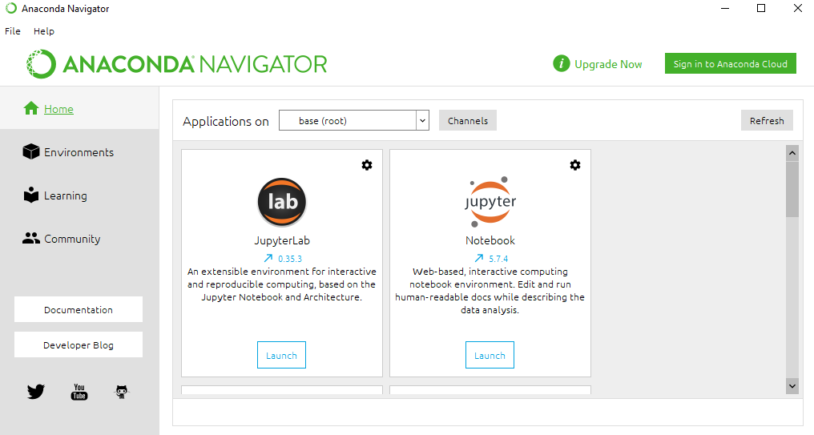

Starting with Python
####################

Python is one of the most popular programming languages in general. In data science, it competes with Matlab and R for first place on the podium.

In our everyday we ofter use python to preprocess and analyze the data. In this tutorial we will explain our preferred way of installing python and managing its libraries. There are several ways to install python this is the one we recommend for its simplicity and flexibility

Installing Python
=================

Anaconda
********

Anaconda is an open-source distribution for python. It is used for data science, machine learning, deep learning, etc. It makes simple to dowload and organize your python enviroment.

To intall Anaconda simply follow this `link <https://www.anaconda.com/products/distribution>`_. Choose a version suitable for you and click on download. Once you complete the download, open the setup.

.. image:: images/GettingStartedPython/setup1.png
  :width: 400
  :alt: Alternative text
  :align: center

|

Follow the instructions in the setup. Don’t forget to click on add anaconda to my path environment variable. As shown below:

.. image:: images/GettingStartedPython/setup2.png
  :width: 400
  :alt: Alternative text
  :align: center

|

After the installation is complete, launch the Anaconda navigator. The Anaconda Navigator is a desktop GUI that comes with the anaconda distribution. Navigator allows you to launch common Python programs and easily manage conda packages, environments, and channels without using command-line commands. Navigator can search for packages on Anaconda Cloud or in a local Anaconda Repository.

|

Miniconda
*********

While Anaconda is one of the most simple way to install python it is quite heavy. It intalls multiple programs and libraries that most of the time are unnecessary. For this reason we prefer tp use Miniconda. Miniconda is a minimal installer for conda. It is a small, bootstrap version of Anaconda that includes only conda, Python, the packages they depend on, and a small number of other useful packages. This means that fewer packages are installed and that we have more controll on what to have on out pc.
To use Miniconda dowload the installer from `here <https://docs.conda.io/en/latest/miniconda.html>`_.

The installation is exactly the same as the one for Anaconda. After it has finished the installation you will find the Anaconda Prompt betwen your programs.
We will use the Anaconda Prompt to intall the packages and the software that we need.

.. image:: images/GettingStartedPython/prompt.png
  :width: 700
  :alt: Alternative text
  :align: center

|

Installing Spyder ide
=====================

Spyder is a powerful scientific environment ide written in Python. Spyder is designed by and for scientists, engineers and data analysts. It integrates very usefull functionalities (variable explorer, plotting, etc.) making it our favorite way to write and run python conde.

When you install the full version of Anaconda, it installs Spyder for you. However, Miniconda doesn’t come with Spyder. Fortunately, Miniconda does make it easy to install. In the Anaconda Prompt type following command and press the “enter” key:

.. code-block:: console

	conda install -c anaconda spyder

After thinking a bit, the Anaconda prompt will prepared a bunch of files to download and ask if you'd like to proceed. Go ahead and type “y” and hit “enter” to proceed.

.. image:: images/GettingStartedPython/prompt_spyder.png
  :width: 700
  :alt: Alternative text
  :align: center

|

It will take a while but after few seconds spyder will be intalled on your computer. To launch it you can click on the shortcut that should have appered in your Start menu or by typing "spyder" in the Anaconda prompt.

Here it is Spyder in all its glory:

.. image:: images/GettingStartedPython/spyder.png
  :width: 700
  :alt: Alternative text
  :align: center

|

Installing packages
===================

To preprocess and analyze the data we will need some specific packages. It is easy to intall and manage packages using conda. Open the Anaconda prompt and type "conda install ...". For exaple, if we want to intall pandas (a very useful package to handle dataframes) we woudl write:

.. code-block:: console

       conda install pandas

After thinking about for few seconds the prompt will dowload the package and its dependencies.

Sometimes conda would fail to find the right package to install. In that case you could try to use pip. Pip works similarly to conda: just type "pip install ...". For example, if we want to intall numpy (an amzing package to handle arrays) we would type:

.. code-block:: console

       conda install numpy

Managing environments
=====================

Python has different versions. Sometimes when we create scripts we needs to run a specific version of python because some of our packages may rely on older version of python or we have conflicting dependecies with othere packages. Virtual environments keep these dependencies in separate “sandboxes” so you can switch between both applications easily and get them running. 

One of the best features of Anaconda and Minconda is the ease with which environments can be created and managed. Conda allows you to create, export, list, remove and update environments in which different versions of Python and/or packages are installed.

Let's create an enviroment called "test" with a older version of python. To do so just opent the Anaconda prompt and type: 

.. code-block:: console

	conda create --name test python=3.7

Press "y" when asked and after few seconds we will have out new "test" enviroment.

Now we want to tell our Anaconda prompt that we want to work on our brand new "test" environment. To do so let's write:

.. code-block:: console

	conda activate test

Now we would probably want to intall some packages and Spyder in this new enviroment. Follow the tutorials above: `Installing Spyder ide`_, `Installing packages`_.

Creating an environment from an environment.yml file
****************************************************

Another interesting feature of conda is that we can save an environment file from an environment we have created. We can later use this file to recreate the same environment with all its packages. This is very convenient when we want to have several people and several PCs with the same environment. We will provide some environment files in our tutorials. These environments have been tested for their specific use and will provide a standard environment for all the users.

To create an enviroment from a enviroment file just type:

.. code-block:: console

	conda env create -f environment.yml

This again will take some time but it will create the new enviroment wiht all the packages specified in it.